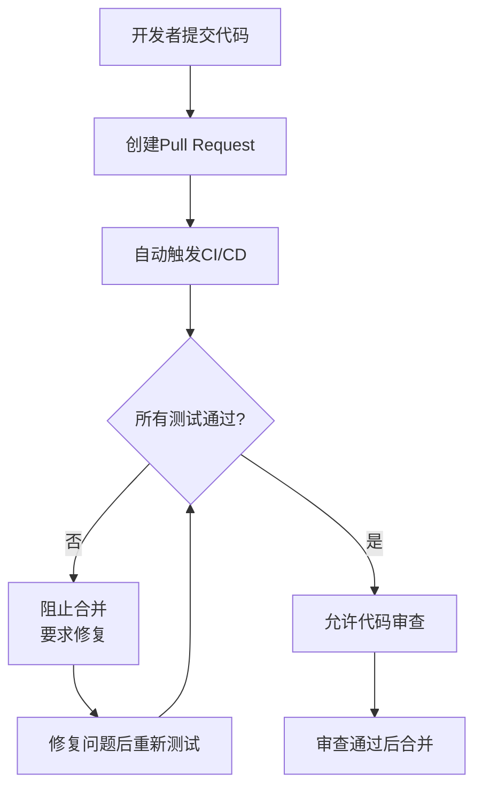

# 分支保护设置指南

## 🛡️ 如何设置GitHub分支保护规则

### 1. 启用分支保护
1. 进入GitHub仓库 → Settings → Branches
2. 点击 "Add rule" 添加规则
3. 在 "Branch name pattern" 输入 `master` 或 `main`

### 2. 必需的保护选项

#### ✅ 基础保护
- [ ] **Restrict pushes that create files** - 限制创建文件的推送
- [x] **Require a pull request before merging** - 合并前需要Pull Request
  - [x] **Require approvals: 1** - 需要至少1个审批
  - [x] **Dismiss stale reviews** - 解散过时的审查
  - [x] **Require review from CODEOWNERS** - 需要代码所有者审查

#### ✅ 状态检查 (关键!)
- [x] **Require status checks to pass before merging** - 合并前必须通过状态检查
  - [x] **Require branches to be up to date** - 要求分支是最新的
  - [x] **Status checks** 选择以下检查:
    - `test (amd64)`
    - `test (arm64)` 
    - `lint`
    - `security-scan`

#### ✅ 其他限制
- [x] **Require conversation resolution** - 需要解决所有对话
- [x] **Require signed commits** - 需要签名提交 (可选)
- [x] **Include administrators** - 管理员也受规则限制

### 3. 工作流程



### 4. CI/CD检查项目

#### 🧪 测试检查
- **语法检查**: 验证shell脚本语法
- **架构兼容性**: 测试AMD64和ARM64支持
- **URL有效性**: 验证下载链接可访问
- **函数完整性**: 确保必要函数存在

#### 🔍 代码质量
- **ShellCheck**: 静态代码分析
- **安全扫描**: 检测硬编码密钥等安全问题

#### 🛡️ 安全检查
- **敏感信息扫描**: 防止泄露密钥/令牌
- **下载安全性**: 验证HTTPS下载

### 5. 绕过保护 (紧急情况)

在紧急情况下，仓库管理员可以:
1. 临时禁用分支保护
2. 使用管理员权限强制推送
3. 完成修复后重新启用保护

⚠️ **注意**: 只有在严重的生产问题时才应绕过保护规则

### 6. 最佳实践

#### 开发流程
1. **创建功能分支**: `git checkout -b feature/new-feature`
2. **本地测试**: 确保代码在本地运行
3. **提交更改**: `git commit -m "详细的提交信息"`
4. **推送分支**: `git push origin feature/new-feature`
5. **创建PR**: 在GitHub上创建Pull Request
6. **等待CI**: 所有自动化测试必须通过
7. **代码审查**: 等待审查者批准
8. **合并**: 自动合并到主分支

#### 提交消息规范
```
类型(范围): 简短描述

详细描述变更内容和原因

- 修复的问题
- 新增的功能
- 破坏性变更说明
```

### 7. 故障排除

#### 常见问题
- **CI失败**: 检查GitHub Actions日志
- **合并被阻止**: 确保所有状态检查通过
- **审查待定**: 联系代码所有者进行审查

#### 调试CI问题
1. 查看Actions页面的详细日志
2. 在本地复现测试环境
3. 修复问题后推送新提交
4. CI会自动重新运行

这个设置确保每次代码变更都经过严格的自动化测试和人工审查，大大提高了代码质量和系统稳定性。